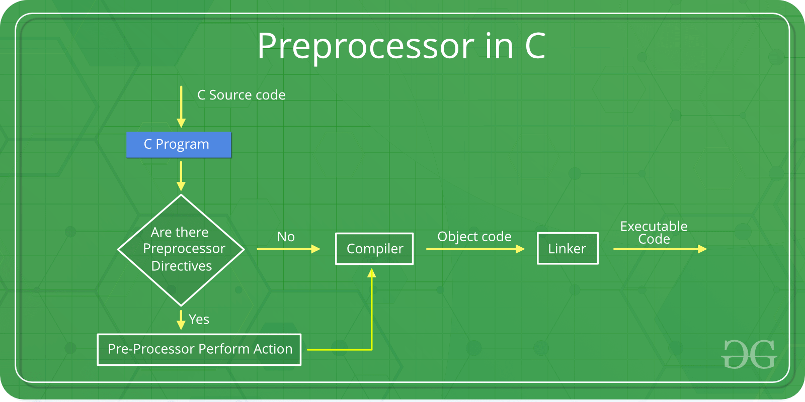

# **c++ preporcessor**

Preprocessor programs provide preprocessor directives that tell the compiler to preprocess the source code before compiling. 
All of these preprocessor directives begin with a `‘#’(hash)` symbol.

Remember that the # symbol only provides a path to the preprocessor, and a command such as include is processed by the preprocessor program. 
For example, #include will include extra code in your program.




There are 4 Main Types of Preprocessor Directives:

1. **Macros:**<br/> Macros are pieces of code in a program that is given some name. Whenever this name is encountered by the compiler, 
the compiler replaces the name with the actual piece of code.

```cpp
#include <iostream>
// macro definition
#define LIMIT 5

int main() {
		for (int i = 0; i < LIMIT; i++) {
			std::cout << i << "\n";
		}
		return 0;
}
```

2. **File Inclusion:**<br/>This type of preprocessor directive tells the compiler to include a file in the source code program. There are two types of files that can be included by the user in the program: `'Header files'` or `'Standard files'`.

3. **Conditional Compilation:**
4. **Other directives# c++ preporcessor**


