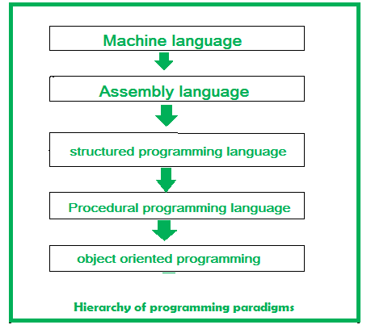

# Object Oriented Design

#### 1.Procedural Programming Approach
---

In this approach, a program is divided into functions that perform specific tasks. This approach is mainly used for medium-sized applications. Data is global, and all the functions can access global data. The basic drawback of the procedural programming approach is that data is not secured because data is global and can be accessed by any function.

#### 2.The Object-Oriented Programming (OOP) Approach
---

The OOP concept was basically designed to overcome the drawback of the Procedural programming methodologies, which were not so close to real-world applications. 
Object-oriented programming (OOP) is nothing but that which allows the writing of programs with the help of certain classes and real-time objects.

#### # Advantages of OOPs – 
---

- It models the real world very well. 
- With OOP, programs are easy to understand and maintain. 
- OOP offers code reusability. Already created classes can be reused without having to write them again. 

#### # Disadvantages of OOP – 
---

- With OOP, classes sometimes tend to be over-generalized. 
- The relations among classes become superficial at times. 
- The OOP design is tricky and requires appropriate knowledge. Also, one needs to do proper planning and design for OOP programming. 